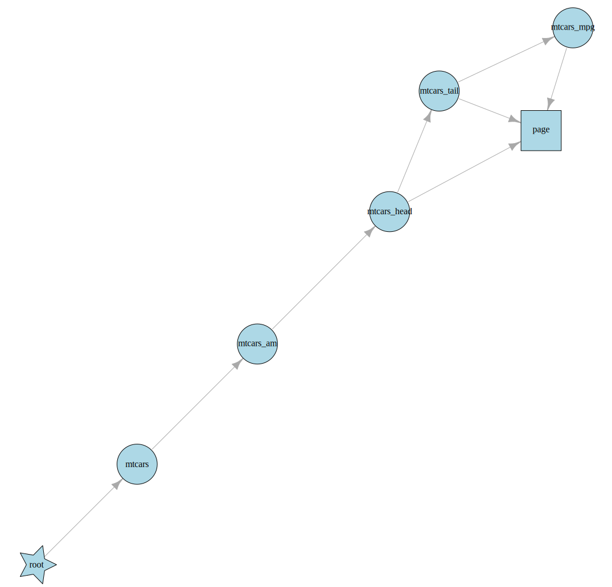

# rixpress: Reproducible Analytical Pipelines with Nix

This package provides a framework for building reproducible analytical
pipelines using Nix, heavily inspired by the R package `{targets}`. It
leverages the `{rix}`, which provides helper function to define
reproducible development environments as code using Nix ensuring the
pipeline runs in a fully reproducible Nix-managed environment. The
pipeline itself is defined in a `pipeline.nix` file, which is
automatically generated based on simple R declarations. Concretely,
`{rix}` made using Nix as a package manager easier for R users,
`{rixpress}` makes it now easy to use Nix as a build automation tool!

For example this R script defines some *derivations* (`d0`, …, `d4` and
`doc`) which are then passed to `rixpress()` to generate the
`pipeline.nix`:

``` r
library(rixpress)

d0 <- rxp_file(mtcars, 'mtcars.csv', \(x) (read.csv(file = x, sep = "|")))
d1 <- rxp_r(mtcars_am, filter(mtcars, am == 1))
d2 <- rxp_r(mtcars_head, head(mtcars_am))
d3 <- rxp_r(mtcars_tail, tail(mtcars_head))
d4 <- rxp_r(mtcars_mpg, select(mtcars_tail, mpg))
doc <- rxp_quarto(page, "page.qmd")

rxp_list <- list(d0, d1, d2, d3, d4, doc)

rixpress(rxp_list)

rxp_make()
```

This script assumes that a `default.nix` is already available to define
the environment, and that the `mtcars.csv` data separated by pipes (`|`…
why? just because). Each output (e.g., `mtcars`, `mtcars_am`,
`mtcars_head`, `mtcars_tail`, `mtcars_mpg`, `page`) is built by Nix
within this environment. The `default.nix` was generated by `{rix}` and
defines an environment with R, R packages, Quarto, and all required
system-level dependencies pinned to a specific date to ensure
reproducibility.

When you run `rixpress(rxp_list)`, it creates `pipeline.nix` and a
`_rixpress/` folder containing a JSON representation of the pipeline’s
DAG (Directed Acyclic Graph). You can visualize the pipeline using
`plot_dag()`:

``` r
plot_dag()
```

<figure>

<figcaption aria-hidden="true">DAG</figcaption>
</figure>

You can read outputs with `rxp_read("mtcars_mpg")` or load them into the
global environment with `rxp_load("mtcars_mpg")`. For complex outputs
such as documents, (for example the Quarto document defined above,
called `page`), `rxp_read("page")` returns its file path, which you can
open with `browseURL("path/to/page")`.

You can export the cache into a file and easily import it on another
machine (or on CI) to avoid having to rebuild everything from scratch
using `export_nix_archive()` and `import_nix_archive()` respectively.

## Purpose

The goal is to create data analysis pipelines that are:

- **Fully Reproducible:** Work the same way across machines and over
  time.
- **Multi-Language:** Allow steps in R, Python (planned), or other
  languages supported by Nix.
- **Inspired by targets:** Mimic its dependency tracking and task
  orchestration, enhanced by Nix’s deterministic builds.

By combining Nix’s reproducibility with a targets-like structure, you
can rebuild every step of your analysis—data processing, modeling,
reporting—exactly as intended, even years later or on different systems
(as long as the sources stay available or the systems are supported by
Nix of course).

## How It Works

### Environment Setup with `default.nix`

- The `rix` package creates a `default.nix` file specifying your
  software environment (e.g., R version, packages). This environment can
  be used traditional interactive data analysis.
- `{rixpress}` generates a `pipeline.nix` which builds a (potentially)
  polyglott data science project using Nix as the build automation tool.
- The `default.nix` generated by `{rix}` is used to provide the right
  environment to the pipeline.

### Pipeline Definition

- Define steps (derivations) in a `pipeline.nix` file, which can use R
  or other languages.
- Each derivation produces outputs like datasets or reports.

### Dependency Graph

- A `dag.json` file maps out the relationships between derivations.
- R scripts process this JSON to add correct dependency loading to
  `pipeline.nix`.

### Building the Pipeline

- Run `rxp_make()` to execute the pipeline, storing outputs in the Nix
  store (e.g., `/nix/store/...`).
- Easily recover the outputs in your current R session using
  `rxp_read()` and `rxp_lead()`.

## Key Advantages of Using Nix

- **Complete Reproducibility:** Pins all dependencies to exact versions.
- **Multi-Language Support:** Unlike `targets`, it’s not limited to R.
- **Isolation:** Each step runs in a sandbox, avoiding system
  interference.
- **Portability:** Share your Nix files, and anyone with Nix can rebuild
  your work.

## Inspiration from `targets`

This package borrows from `targets`:

- **Dependency Tracking:** Ensures steps only rerun when inputs change.
- **Modularity:** Breaks workflows into reusable steps.
- **Automation:** Executes tasks in the right order.

Nix extends these ideas beyond R into a cross-language, reproducible
framework.

## Installation

### Prerequisites

#### Install Nix

tbd

### Install from GitHub

To install this package directly from GitHub, use the `remotes` R
package:

``` r
# Install remotes if you don’t have it
if (!require("remotes")) install.packages("remotes")

# Install the package from GitHub
remotes::install_github("b-rodrigues/rixpress")
```

## Usage Example

### Define Your Pipeline in R

``` r
# Create derivations
d1 <- rxp_r(mtcars_am, filter(mtcars, am == 1))
d2 <- rxp_r(mtcars_head, head(mtcars_am))

# Collect into a list
rxp_list <- list(d1, d2)

# Save or process further (e.g., generate pipeline.nix and dag.json)
```

### Build the Pipeline

``` r
rxp_make()
```

This builds all derivations, producing outputs in the Nix store.

## Contributing

TBD
